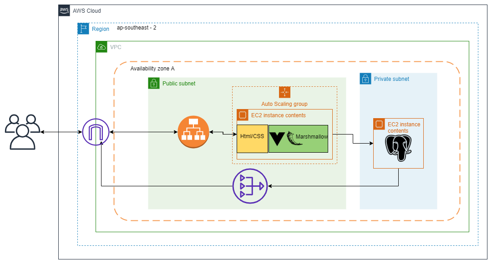

# Facial Recognition Application

https://github.com/seanremenyi/FacialRecog

#### Purpose

The purpose of this application is to give users an easy to use web application to do facial analysis on images.

#### Functionality/Features

The application will function by leveraging several services from AWS. Users will create an account to login into the application. Password hashing will be used to secure password details in the database. To start a session, users with accounts will need a JSON web token which will be obtained upon a successful login. From there they will be able to upload images. The images will be uploaded to an S3 bucket and then passed onto one of the machine learning services available on AWS called Rekognition. This service will regonize facial features of the person in the image and output the data back to an S3 bucket from which the application will grab it and display it to the user. As a way to monitor any untoward activity, if ever rekognition sees an image that it's less than 50% sure contains a face, it wil trigger a lambda function which will in turn use AWS' SNS service to send the admin an email for further investigation.

At the moment the MVP (minimal viable product) will be using a basic Rekognition feature which will recognize a face in an image and output metrics to answer the following questions,
1. How confident Rekognition is that it is a face in the image
2. Where the face is located in the image
3. What emotion is displayed (and a confidence metric of that value)
4. Whether the person is smiling (and a confidence metric of that value)
5. Is their mouth open (and a confidence metric of that value)
6. Do they have a mustache (and a confidence metric of that value)
7. Are their eyes open (and a confidence metric of that value)
8. Are they wearing glasses (and a confidence metric of that value)

The application itself will include the following features:
- DNS
- Password hashing
- Basic authorization using JSON token
- SSL encryption
- Machine Learning
- Load balanging and Auto-scaling
- Interactive front-end

Future versions of this application will include:
- The ability to recognize faces from 2 different images and compare them to see if they match
- The ability to recognize a face of a person in one image then identify if they are in another image of a group of people

#### Target audience

The target audience for this application will be anyone you wants to get information on facial features of a person in an image. Any user with access to an internet connection will have access to this web application.

#### Tech Stack
The application will use the following tech stack along with each tech's purpose
- **Python** used for the backend of the application
- **Vue** used for the front end of the application
- **Flask** used for the web framework
- **AWS ReKognition** used for image recognition
- **PostgreSQL** used for the database
- **SQLAlchemy** used to avoid raw SQL inputs
- **AWS Route53** used for DNS
- **Bcrypt** used for password hashing
- **JWTManager** used for JSON web tokens
- **HTML/CSS** used for website content and styling
- **AWS S3** used for image hosting
- **AWS Frameworks** used for hosting the application in the cloud
- **Marshmallow** used as an ORM

#### Dataflow Diagram

#### Application Architecture

The Infrastructure is as follows:
- The application and database will be hosted on the AWS cloud in the ap-southeast-2 region
- In a created virtual private cloud in Availability Zone A, there will be 2 configured subnets, one public and one private
- The private subnet will house the database and the public subnet will house the application and other configurations
- The subnets will be able to communicate with the internet and users through an internet gateway on the VPC
- The public subnet will be able to interact with th internet gateway directly (and routing tables will be configured)
- The private subnet will be able to communicate outbound to the the internet through the use of a NAT gateway in the public subnet and attached to the internet gateway.
- For inbound traffic, the application EC2 will also serve as a jumpbox.
- The private subnet will house an EC2 with a postgreSQL server on it for the applications database
- The application consists of javascript's Vue for templating, HTML/CSS for front end, Flask for the web framework and Marshmallow as an ORM 
- This application EC2 sits behind an application load balancer
- This application EC2 also will sit within an Auto Scaling Group, if the application starts getting many requests, another EC2 with the same launch template will be spun up.
- When more than one EC2 is running the load balancer will direct traffic to make sure neither EC2 is being overloaded with requests.
- All security group configurations will be appropriately configured.

#### User Stories

**Brainstorming**

**Revised**

#### Wireframes

**1. Login Page**

This is the landing page of the web application. Users will be able to sign in with their username and password or have the option to enter a new username and password and hit create account. The title of the application is displayed on every page as well as a link with my name on it taking the user to my portfolio website.

**2. Unssucessful Pages**

There's 2 possible errors from the landing page, either a user will try to sign in and have the incorrect password or someone tries to create an account with a username that is already taken. In either case an error page will be displayed depending on the issue.

**3. Upload Page**

Once successfully logged on the user will be brought to a page to upload an image. 

**4. Preview**

Once the image is uploaded, a preview of the image will appear and the user will be able to press scan to coninue with the facial recognition or upload a different image.

**5. output**

The final page will again have the preview of the image however next to it will have all the metrics obtained from Rekognition deisplayed next to it.

#### Workflow

This project will adopt an agile workflow. I will be planning 2 spints. One for planning and design and will carry over 2 weeks and the other for development and testing which will take 3 weeks. I will be using Trello boards to keep track of each task as well as any blockers that my arise.

##### Sprint 1

**Feb. 14th 11:00AM**

**Feb. 15th 6:00PM**

**Feb. 18th 10:00PM**

**Feb. 20th 9:00PM**

##### Sprint 2

**Feb. 21st 5:00 PM**

